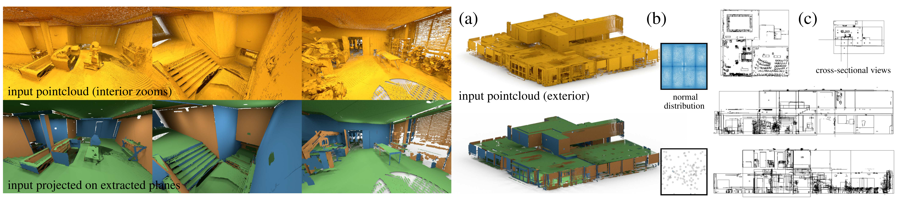

RAPter
=======
Project page: [RAPter: Rebuilding Man-made Scenes with Regular Arrangements of Planes](http://geometry.cs.ucl.ac.uk/projects/2015/regular-arrangements-of-planes)<br />
Venue: [SIGGRAPH 2015](https://s2015.siggraph.org) <br />
Authors: [Aron Monszpart](http://geometry.cs.ucl.ac.uk/amonszpart)<sup>1</sup>, [Nicolas Mellado](https://www.irit.fr/recherches/VORTEX/MelladoNicolas/)<sup>1,2</sup>, [Gabriel J. Brostow](http://www0.cs.ucl.ac.uk/staff/g.brostow/)<sup>1</sup>, [Niloy J. Mitra](http://geometry.cs.ucl.ac.uk)<sup>1</sup><br />
<sup>1</sup>University College London <sup>2</sup>CNRS-IRIT (Toulouse, France)


<br />We present a novel approach to extract a Regular Arrangements of Planes (RAP) from an unstructured and noisy raw scan (shown in gold). (a) In this example, our algorithm reconstructs a building arrangement from a raw pointcloud, pre-assembled from multiple laser scans. (b) The distribution of the initial normals is very noisy in this scene, which makes any greedy arrangement of planes error-prone. Instead, we propose a global algorithm to simultaneously select both the planes along with their sparse inter-relations. (c) Cross-sectional views reveal discovered regularity of the extracted arrangement at multiple scales, _e.g._, walls, stairways, chairs, etc.

## _Abstract_

With the proliferation of acquisition devices, gathering massive volumes of 3D data is now easy. Processing such large masses of pointclouds, however, remains a challenge. This is particularly a problem for raw scans with missing data, noise, and varying sampling density. In this work, we present a simple, scalable, yet powerful data reconstruction algorithm. We focus on reconstructing man-made scenes as regular arrangements of planes (RAP), thereby selecting both local plane-based approximations along with their global inter-plane relations. We propose a novel selection formulation to directly balance between data fitting and the simplicity of the resulting arrangement of extracted planes. The main technical contribution is a formulation that allows less-dominant orientations to still retain their internal regularity, and not being overwhelmed and regularized by the dominant scene orientations. We evaluate our approach on a variety of complex 2D and 3D pointclouds, and demonstrate the advantages over existing alternative methods.


## This repository


RAPter provides a set of tools to generate, segment, approximate, and visualize 2D and 3D point clouds with ground truth. It also comes with a set of quantitative and qualitative tests to evaluate the approximation results regarding the ground truth.
The different modules are:
* inputGen: to generate 2D point clouds and ground truth abstraction from svg files. It provides different samplers to convert svg primitives to point clouds and stackable noise kernels (bias, random noise with uniform and normal distribution).
* visualization: based on PCL viewer, support both 2D and 3D point clouds and inter-primitive relations.
* RAPter: the core of the project, a new approach to approximate scenes with primitives supported by global relations.

### Dependencies
* 3rd Party:
** CoinBonmin (optimisation)
** libfbi (fast box intersection)
All dependencies are assumed to be available in a workspace folder and a `3rdparty` subdirectory.

RAPter also requires OpenCV and PointCloudLibrary, and we recommend to use respectively the last stable release and the development branch for these packages (tested with Ubuntu 14.04 and Debian Testing).

Ubuntu packages: python-pygraphviz

### CoinBonmin
First, download Bonmin in `${WORKSPACE}/3rdparty`:
```
svn co https://projects.coin-or.org/svn/Bonmin/stable/1.5 CoinBonmin-stable
```
Then:
* install the following packages (Debian/Ubuntu): `liblapack-dev libblas-dev fortran-compiler`.
* install 3rd party solver using the script `path/to/Bonmin/ThirdParty/Mumps/get.Mumps`.
* Compile and install:
```
mkdir build
cd build
../configure -C
make
make -install
```

### libfbi
Download in `${WORKSPACE}/3rdparty` from [Github](https://github.com/mkirchner/libfbi.git).
No installation required.

## Compilation
### RAPter
Once all the dependencies are satisfied, you can build RAPter. By default, dependencies are expected to be in `/home:${USER}/workspace/` (you may need to edit CMakelist.txt to change that behaviour). 
```
mkdir build
cd build
cmake -DCMAKE_BUILD_TYPE=Release ..
make
```

### InputGen
Just compile using cmake like usual.
